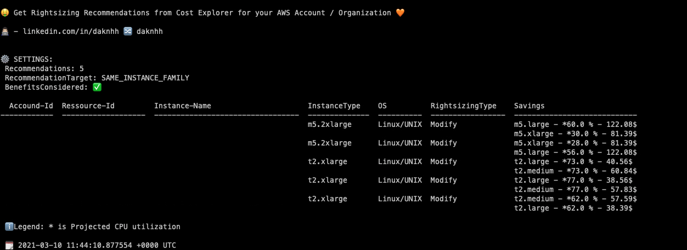

## Table of contents
* [General info](#general-info)
* [Usage](#usage)

## General info
This Tool is get the [Rightsizing Recommendations](https://docs.aws.amazon.com/awsaccountbilling/latest/aboutv2/ce-rightsizing.html) from Cost Explorer for your AWS Account / Organization.

## Tool info:
|Version |Author  | 
--- | --- |
|1.0 | David Krohn   [Linkedin](https://www.linkedin.com/in/daknhh/) - [Blog](https://globaldatanet.com/blog/author/david-krohn)|

## Usage
- `python rightsizing-recommendation.py --top RECOMMENDATIONRESULTS --bc BENEFITSCONSIDERED --rt RECOMMENDATIONTARGET --p AWSPROFILE `

### INFO 

- RECOMMENDATIONRESULTS
    Define how much recommendations results you want to get. 
- BENEFITSCONSIDERED
    The option to consider RI or Savings Plans discount benefits in your savings calculation. Allowed values: t | f.
- RECOMMENDATIONTARGET
    The option to see recommendations within the same instance family, or recommendations for instances across other families.
    Allowed values: SAME_INSTANCE_FAMILY | CROSS_INSTANCE_FAMILY

### How to use the tool with virtual env:

1. Creating virtual env: 
`python3 -m venv rightsizingrecommendations`

2. Activate virtual env:
`source orgtool/bin/activate`